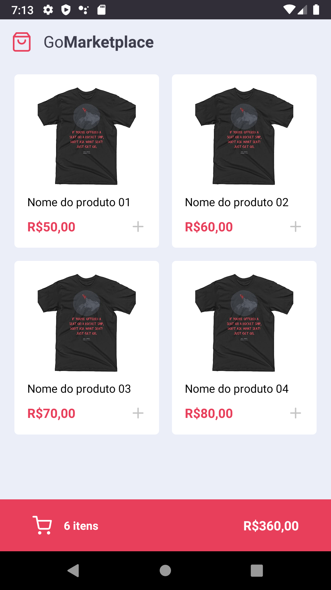
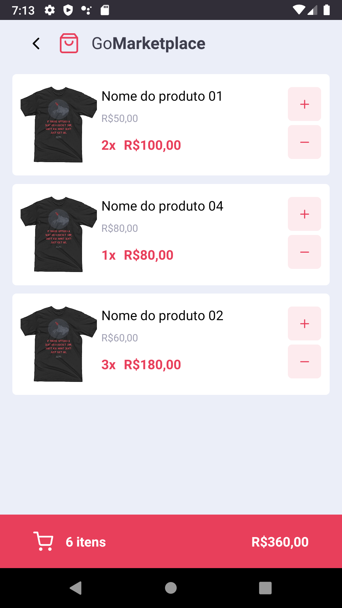

####  Bootcamp - GoStack 11
# 🚀 Desafio 08 - Fundamentos React-Native (GoMarketplace App Mobile)

## Sobre
- Criar uma nova aplicação em React Native com TypeScript, para praticar os conceitos de rotas, Async Storage e a Context API.
- O aplicativo será chamado `GoMarketplace`, versão mobile
- [Instruções para o Desafio](docs/Desafio%2008%20-%20Instru%C3%A7%C3%B5es.pdf)

## Protótipo - GoMarketplace (App Mobile)

|Dashboard|Cart|
|-|-|
|||

---

## Tecnologias utilizadas

#### Dependências de Projeto
- [@react-native-community/async-storage](https://yarnpkg.com/package/@react-native-community/async-storage)
- [@react-native-community/masked-view](https://yarnpkg.com/package/@react-native-community/masked-view)
- [@react-navigation/native](https://yarnpkg.com/package/@react-navigation/native)
- [@react-navigation/stack](https://yarnpkg.com/package/@react-navigation/stack)
- [axios](https://yarnpkg.com/package/axios)
- [intl](https://yarnpkg.com/package/intl)
- [json-server](https://yarnpkg.com/package/json-server)
- [react](https://yarnpkg.com/package/react)
- [react-native](https://yarnpkg.com/package/react-native)
- [react-native-gesture-handler](https://yarnpkg.com/package/react-native-gesture-handler)
- [react-native-iphone-x-helper](https://yarnpkg.com/package/react-native-iphone-x-helper)
- [react-native-reanimated](https://yarnpkg.com/package/react-native-reanimated)
- [react-native-safe-area-context](https://yarnpkg.com/package/react-native-safe-area-context)
- [react-native-screens](https://yarnpkg.com/package/react-native-screens)
- [react-native-vector-icons](https://yarnpkg.com/package/react-native-vector-icons)
- [styled-components](https://yarnpkg.com/package/styled-components)

#### Dependências de Desenvolvimento
- [@babel/core](https://yarnpkg.com/package/@babel/core)
- [@babel/runtime](https://yarnpkg.com/package/@babel/runtime)
- [@react-native-community/eslint-config](https://yarnpkg.com/package/@react-native-community/eslint-config)
- [@testing-library/jest-native](https://yarnpkg.com/package/@testing-library/jest-native)
- [@testing-library/react-native](https://yarnpkg.com/package/@testing-library/react-native)
- [@types/jest](https://yarnpkg.com/package/@types/jest)
- [@types/react-native](https://yarnpkg.com/package/@types/react-native)
- [@types/react-native-vector-icons](https://yarnpkg.com/package/@types/react-native-vector-icons)
- [@types/react-test-renderer](https://yarnpkg.com/package/@types/react-test-renderer)
- [@types/styled-components](https://yarnpkg.com/package/@types/styled-components)
- [@typescript-eslint/eslint-plugin](https://yarnpkg.com/package/@typescript-eslint/eslint-plugin)
- [@typescript-eslint/parser](https://yarnpkg.com/package/@typescript-eslint/parser)
- [axios-mock-adapter](https://yarnpkg.com/package/axios-mock-adapter)
- [babel-jest](https://yarnpkg.com/package/babel-jest)
- [eslint](https://yarnpkg.com/package/eslint)
- [eslint-config-airbnb](https://yarnpkg.com/package/eslint-config-airbnb)
- [eslint-config-airbnb-typescript](https://yarnpkg.com/package/eslint-config-airbnb-typescript)
- [eslint-config-prettier](https://yarnpkg.com/package/eslint-config-prettier)
- [eslint-import-resolver-typescript](https://yarnpkg.com/package/eslint-import-resolver-typescript)
- [eslint-plugin-import](https://yarnpkg.com/package/eslint-plugin-import)
- [eslint-plugin-jsx-a11y](https://yarnpkg.com/package/eslint-plugin-jsx-a11y)
- [eslint-plugin-prettier](https://yarnpkg.com/package/eslint-plugin-prettier)
- [eslint-plugin-react](https://yarnpkg.com/package/eslint-plugin-react)
- [eslint-plugin-react-hooks](https://yarnpkg.com/package/eslint-plugin-react-hooks)
- [jest](https://yarnpkg.com/package/jest)
- [metro-react-native-babel-preset](https://yarnpkg.com/?q=metro-react-native-babel-preset)
- [prettier](https://yarnpkg.com/package/prettier)
- [react-test-renderer](https://yarnpkg.com/package/react-test-renderer)
- [ts-jest](https://yarnpkg.com/package/ts-jest)
- [typescript](https://yarnpkg.com/package/typescript)

---

## Como executar
- Crie uma pasta para o projeto
- Acesse a pasta
- Faça o clone do template modelo
```
$ git clone https://github.com/fabiosvf/bootcamp-gostack-11-desafio-08-fundamentos-react-native.git .
```
- Atualize as bibliotecas
```
$ yarn
```
- Para iniciar o simulados de Serviço Fake, digite:
```
$ yarn json-server server.json -p 3333
```
- Para iniciar o aplicativo no Android, digite:
```
$ yarn android
```
- Caso o Metro Bundle não tenha sido aberto por qualquer motivo, basta digitar o seguinte comando:
  - E em seguida atualizar a aplicação no emulador do dispositivo mobile
```
$ yarn start
```
